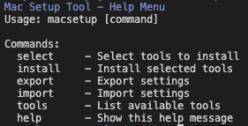
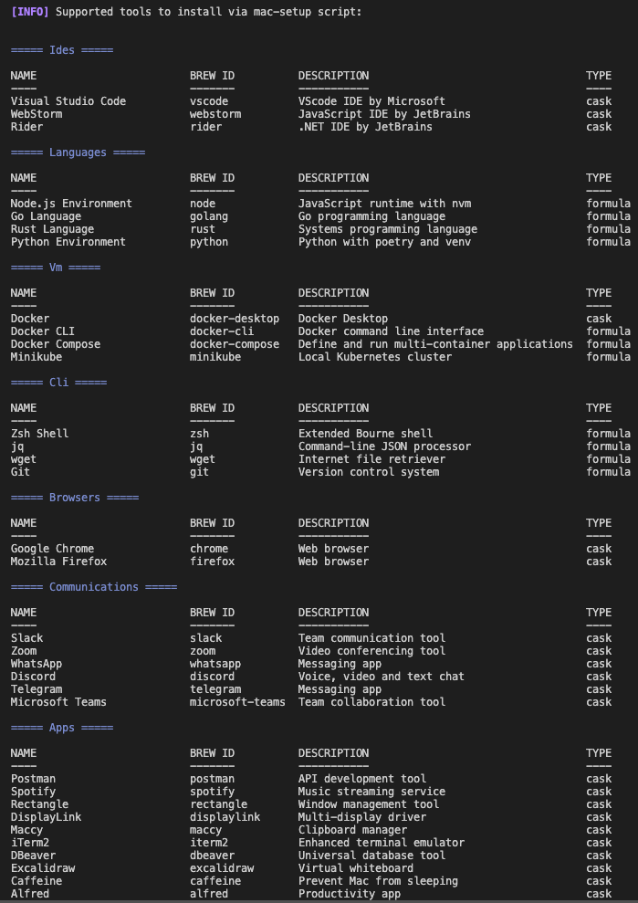
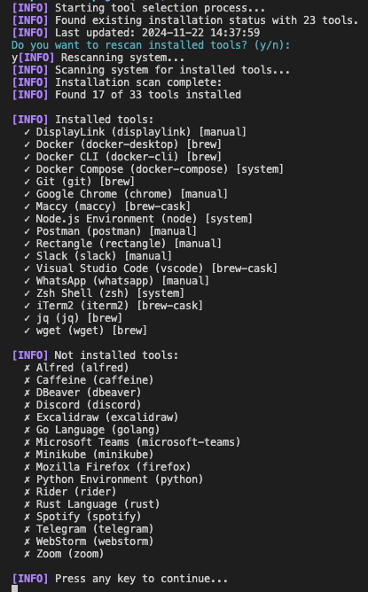

# Dev Tools Installer

Automate the setup of your a new Mac for development environments.

## table of contents
- [Dev Tools Installer](#dev-tools-installer)
  - [table of contents](#table-of-contents)
  - [Quick Start](#quick-start)
  - [Declaimer](#declaimer)
    - [Features](#features)
    - [Usage](#usage)
    - [Supported Tools](#supported-tools)
  - [Demo](#demo)
  - [Structure](#structure)
  - [License](#license)


## Quick Start
```bash
curl -sSL https://raw.githubusercontent.com/naorz/mac-setup/main/start.sh | bash -s select
```

## Declaimer
> 🚧 Currently under development, use at your own risk.  

Verified modules:  
- [x] select
- [x] tools
- [x] help
- [x] install
- [ ] export 🚧
- [ ] import 🚧

### Features
- 📦 Package management via Homebrew
- 🛠 Development tools installation
- 🚧 🔄 Export/Import macos system settings
- ⚡️ Resume interrupted installations
- ☁️ Settings sync via GitHub Gists

### Usage
1. Select tools: ./start.sh select
2. Install tools: ./start.sh install
3. Print available tools: ./start.sh tools
4. Help: ./start.sh help
5. Not tested yet:
   1. Export (macOS preferences) settings: ./start.sh export [--gist]
   2. Import (macOS preferences) settings: ./start.sh import [gist-id|file]

### Supported Tools
- IDEs: Visual Studio Code, WebStorm, Rider
- Languages: Node.js, Go, Rust, Python
- VM: Docker, Minikube
- CLI: zsh, jq, wget, git
- MacOS misc apps: Rectangle, DisplayLink, Maccy, iTerm2, Slack, Zoom, Postman, Alfred, 1Password, Spotify, Notion, Firefox, Chrome, Brave

## Demo






## Structure
```
mac-setup/
├── setup.sh
├── README.md
├── script.json
└── src/
    ├── common/
    │   ├── colors.sh
    │   ├── logging.sh
    │   ├── utils.sh
    │   ├── gist.sh
    │   ├── state.sh
    │   ├── dependencies.sh
    │   └── installation_tracker.sh
    ├── modules/
    │   ├── select.sh
    │   ├── install.sh
    │   ├── export.sh
    │   ├── import.sh
    |   ├── tools.sh
    │   └── help.sh
    ├── config/
    │   └── tools.json
    └── state/
```

## License
This project is licensed under the MIT License - see the [LICENSE](LICENSE) file for details.
